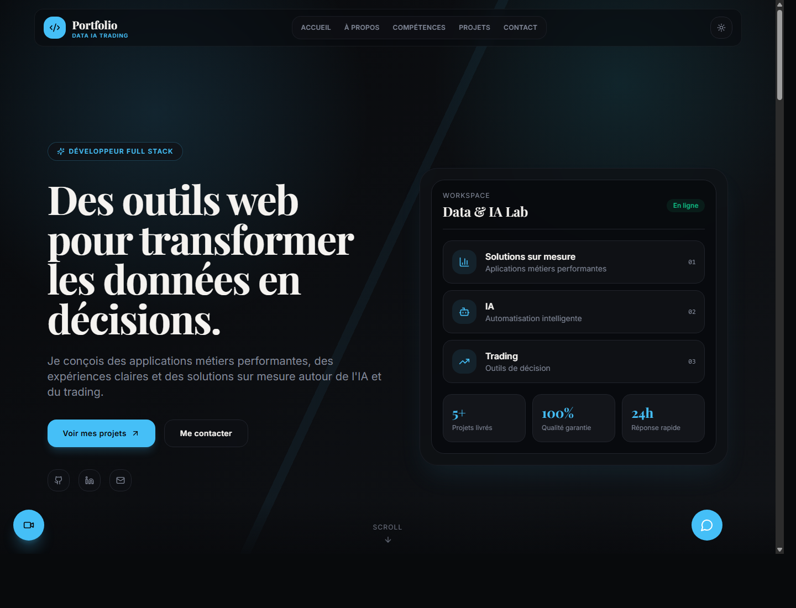
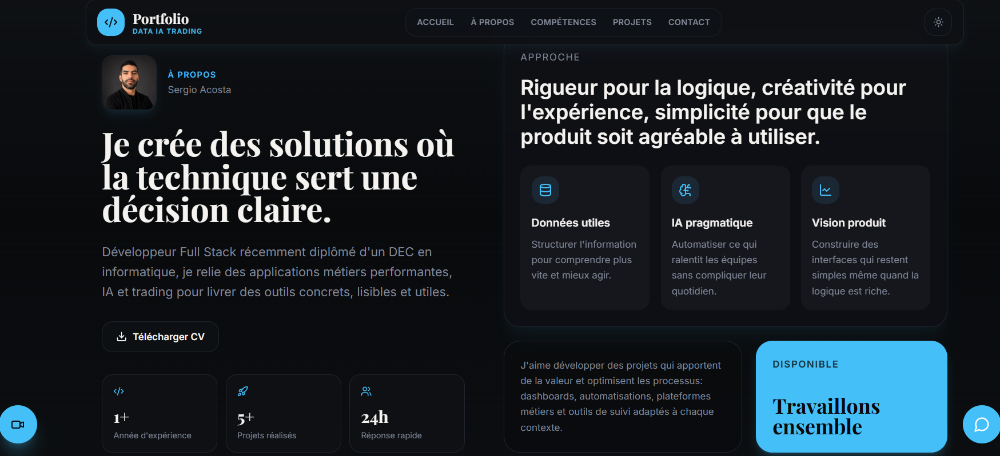
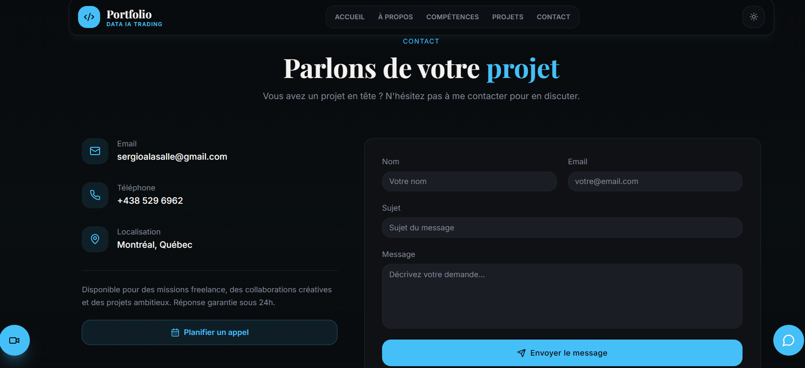
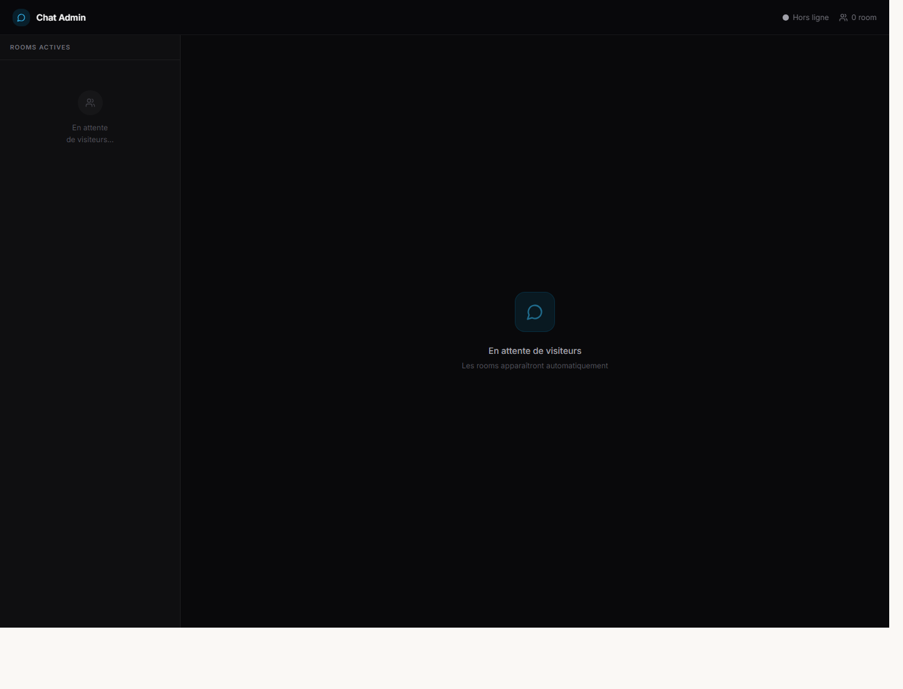

# Portfolio Professionnel & Communication Temps Reel

Portfolio full-stack construit avec React, Tailwind CSS, Node.js, Express et Socket.IO. Le projet inclut un site portfolio responsive, un chat texte en temps reel, des notifications Telegram, planifications des meetings avec Calendly et une fonctionnalite d'appel video.

## Stack

**Frontend**
- React + Vite
- Tailwind CSS
- React Router
- Framer Motion
- Socket.IO Client
- WebRTC natif
- EmailJS
- Calendly

**Backend**
- Node.js
- Express
- Socket.IO
- dotenv
- CORS
- Telegram Bot API

**Infrastructure**
- Docker
- Docker Compose

## Structure

```text
portfolio_chat/
|-- client/     # Aplication React/Vite
|   |-- Dockerfile
|   |-- .env.example
|   |-- vercel.json
|   |-- public/
|   |   |-- screenshots/
|   |   |-- Sergio_Acosta_CV.pdf
|   |   `-- sergio-profile.png
|   |-- src/
|   |   |-- components/
|   |   |   |-- portfolio/
|   |   |   |   |-- AboutSection.jsx
|   |   |   |   |-- ContactSection.jsx
|   |   |   |   |-- HeroSection.jsx
|   |   |   |   |-- LiveChat.jsx
|   |   |   |   |-- Navbar.jsx
|   |   |   |   |-- ProjectsSection.jsx
|   |   |   |   |-- SkillsSection.jsx
|   |   |   |   `-- VideoChat.jsx
|   |   |   `-- ui/
|   |   |-- pages/
|   |   |   `-- Home.jsx
|   |   |-- lib/
|   |   |-- data/
|   |   |-- App.jsx
|   |   `-- main.jsx
|   |-- package.json
|   `-- vite.config.js
|-- server/       # Serveur Express + Socket.IO
|   |-- Dockerfile
|   |-- .env.example
|   `-- server.js
|-- docker-compose.yml
|-- .env.example
|-- package.json
|-- package-lock.json
|-- README.md
`-- .gitignore
```

## Captures D'ecran

### Accueil



### A propos



### Contact



### Chat Admin



## Variables D'environnement

Copier les fichiers d'exemple avant de lancer le projet.

```bash
cp .env.example .env
cp client/.env.example client/.env
cp server/.env.example server/.env
```

Sur Windows PowerShell, creer les fichiers manuellement ou copier le contenu des `.env.example`.

### Racine `.env`

Utilise par `docker-compose.yml` et par le backend quand il est lance depuis la racine.

```env
PORT=3001
CLIENT_URL=http://localhost:5173
ADMIN_DASHBOARD_URL=http://localhost:5173/chat

NOTIFY_CHANNEL=telegram
TELEGRAM_BOT_TOKEN=your_bot_token
TELEGRAM_CHAT_ID=your_chat_id

VITE_EMAILJS_SERVICE_ID=your_service_id
VITE_EMAILJS_TEMPLATE_ID=your_template_id
VITE_EMAILJS_PUBLIC_KEY=your_public_key
```

### Client `client/.env`

```env
VITE_CHAT_SERVER_URL=http://localhost:3001
VITE_EMAILJS_SERVICE_ID=your_service_id
VITE_EMAILJS_TEMPLATE_ID=your_template_id
VITE_EMAILJS_PUBLIC_KEY=your_public_key
```

### Serveur `server/.env`

```env
PORT=3001
CLIENT_URL=http://localhost:5173
ADMIN_DASHBOARD_URL=http://localhost:5173/chat

NOTIFY_CHANNEL=telegram
TELEGRAM_BOT_TOKEN=your_bot_token
TELEGRAM_CHAT_ID=your_chat_id
```

Ne jamais publier les fichiers `.env` reels. Utiliser seulement les `.env.example` dans Git.

## Installation Locale

Installer les dependances de la racine et du client.

```bash
npm install
cd client
npm install
cd ..
```

Lancer frontend et backend ensemble:

```bash
npm run dev
```

URLs locales:

- Frontend: `http://localhost:5173`
- Backend: `http://localhost:3001`
- Admin chat: `http://localhost:5173/chat`

## Docker

Le projet peut etre lance avec une seule commande:

```bash
docker-compose up --build
```

Services exposes:

- `portfolio-client`: `http://localhost:5173`
- `portfolio-server`: `http://localhost:3001`

Verifier les conteneurs:

```bash
docker-compose ps
```

Voir les logs:

```bash
docker-compose logs --tail=40 client
docker-compose logs --tail=40 server
```

Arreter les services:

```bash
docker-compose down
```

## Fonctionnalites

### Portfolio

- Hero responsive avec animation
- Sections A propos, competences, projets, contact et footer
- Mode clair/sombre avec toggle
- Navigation fluide avec header fixe
- Animations Framer Motion

### Chat Temps Reel

- Bouton flottant integre au portfolio
- Messages en temps reel avec Socket.IO
- Salles de conversation visiteur/admin
- Historique en memoire pendant la session serveur
- Horodatage cote serveur
- Notification Telegram au premier message visiteur
- Interface admin disponible sur `/chat`

### Appel Video WebRTC

- Creation de salle video
- Rejoindre une salle par code
- Acces camera/micro avec `getUserMedia`
- Video locale et video distante
- Mute/unmute microphone
- Activation/desactivation camera
- Terminer l'appel et liberation des ressources
- Signalisation WebRTC via Socket.IO
- Serveurs STUN publics Google

## Scripts

```bash
npm run dev          # Lance client + serveur
npm run dev:client   # Lance seulement Vite
npm run dev:server   # Lance seulement Express/Socket.IO
npm run build        # Build du frontend
```

## Endpoints Principaux

Chat:

- `POST /api/live-chat/notify`
- `GET /api/live-chat/rooms`

Video:

- `POST /api/video/rooms`
- `GET /api/video/rooms/:roomId`

Socket.IO:

- `join-room`
- `message`
- `video:join-room`
- `video:offer`
- `video:answer`
- `video:ice-candidate`
- `video:leave-room`

## Deploiement

Deploiement actuel:

- Frontend Vercel: `https://my-portfolio-two-theta-kq3fil0jzy.vercel.app`
- Backend Render: `https://my-portfolio-api-1ldo.onrender.com`
- Admin chat: `https://my-portfolio-two-theta-kq3fil0jzy.vercel.app/chat`

Variables importantes en production:

- `CLIENT_URL`: `https://my-portfolio-two-theta-kq3fil0jzy.vercel.app`
- `ADMIN_DASHBOARD_URL`: `https://my-portfolio-two-theta-kq3fil0jzy.vercel.app/chat`
- `VITE_CHAT_SERVER_URL`: `https://my-portfolio-api-1ldo.onrender.com`
- `TELEGRAM_BOT_TOKEN`
- `TELEGRAM_CHAT_ID`
- `VITE_EMAILJS_SERVICE_ID`
- `VITE_EMAILJS_TEMPLATE_ID`
- `VITE_EMAILJS_PUBLIC_KEY`

Le frontend utilise `client/vercel.json` pour rediriger les routes React vers `index.html`. Cela permet d'ouvrir directement `/chat?roomId=...` depuis Telegram.

## Securite

- Les `.env` reels sont ignores par Git.
- Les tokens Telegram et les cles EmailJS ne sont pas hardcodes dans le code source.
- Si un token a deja ete publie dans GitHub, il faut le regenerer.

## Etat Du Projet

Fonctionnel:

- Portfolio React
- Chat texte Socket.IO
- Notifications Telegram
- Appel video WebRTC
- Docker Compose local
- Deploiement Vercel + Render
- Liens vers Linkedin, Github et CV
- Planification des meetings avec Calendly
- Tests production

